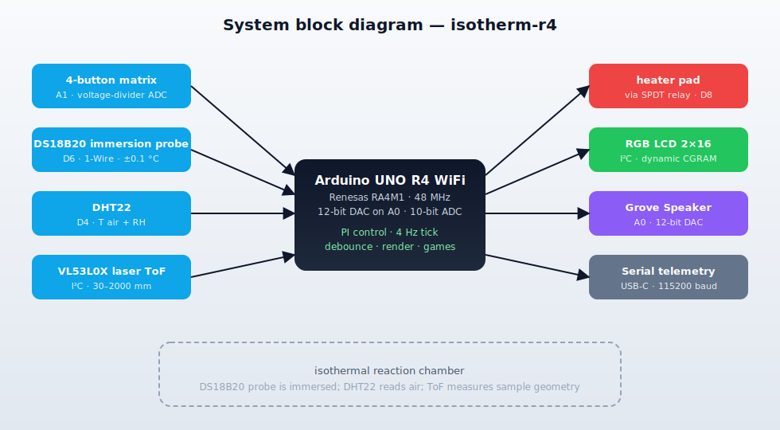
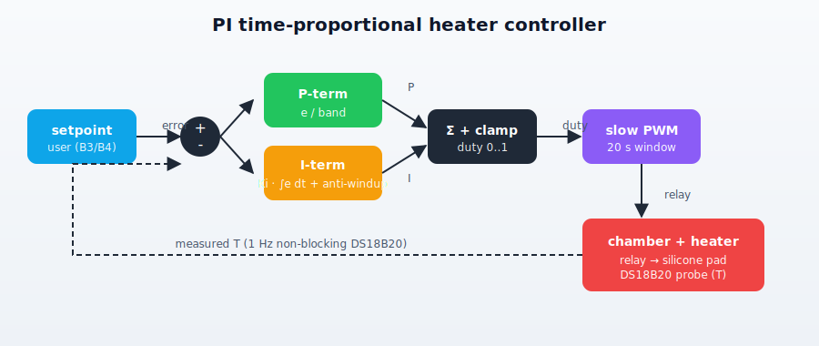
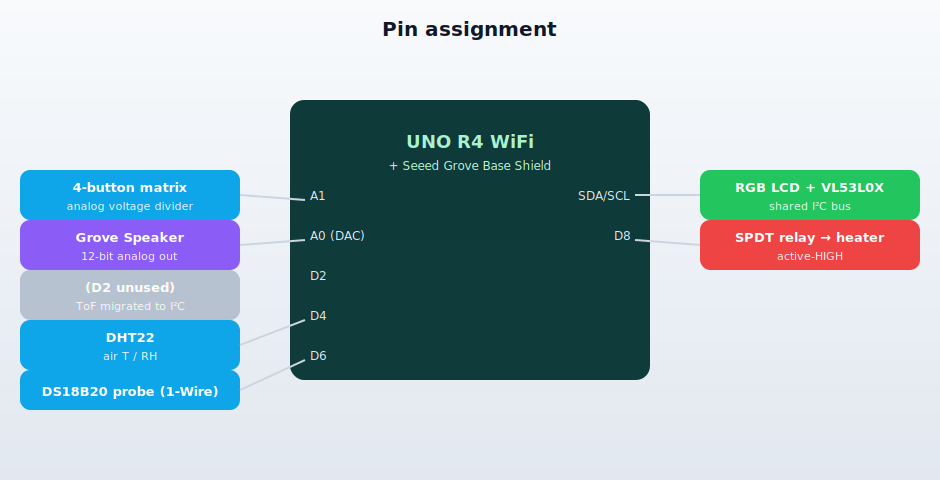
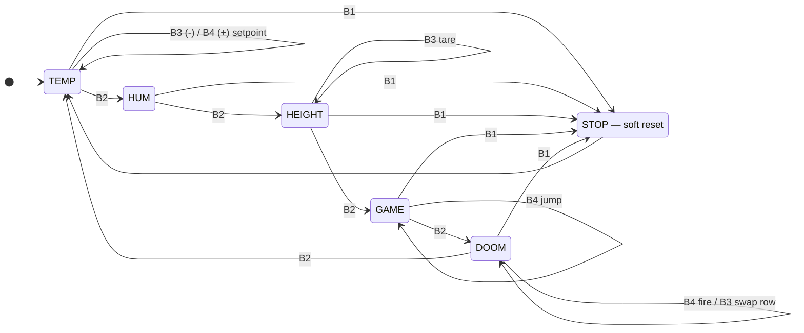

# isotherm-r4

> A self-contained **isothermal reaction-chamber controller** built around the Arduino UNO R4 WiFi.
> Closed-loop PI control of a heater, multi-sensor instrumentation, a four-button analog matrix on a single ADC pin, and a dynamic-CGRAM 16×2 RGB LCD — packaged as an instrument for slow chemistry.

<p align="center">
  
</p>

---

## Table of contents

- [Design goals](#design-goals)
- [Why isothermal control](#why-isothermal-control)
- [Hardware](#hardware)
- [Pin map](#pin-map)
- [Analog button matrix](#analog-button-matrix)
- [Control loop](#control-loop)
- [Operator interface](#operator-interface)
- [Firmware](#firmware)
- [Build and flash](#build-and-flash)
- [Reproducing the diagrams](#reproducing-the-diagrams)
- [Roadmap](#roadmap)
- [Repository layout](#repository-layout)

---

## Design goals

The rig is built around a single question: **how far can one low-cost microcontroller be pushed when running a real chemistry experiment end-to-end?**

- stable thermal regulation across a thermally-laggy chamber,
- multi-sensor instrumentation at the *right* per-sensor sampling cadence,
- a usable operator panel,

…without pulling in an RTOS, a pixel-graphics LCD, or any external compute.

## Why isothermal control

Most condensed-phase reactions follow the **Arrhenius relation**

```
k(T) = A · exp(−E_a / R T)
```

A 1 °C drift at room temperature shifts the rate of a typical reaction with *E_a ≈ 60 kJ mol⁻¹* by roughly **8 %**, and many enzyme- or microbe-mediated processes follow the empirical *Q₁₀ ≈ 2–3* rule (rate doubles or triples per 10 °C). For kinetics work and slow autocatalytic systems, **holding the chamber on a setpoint to within a fraction of a degree is the difference between a reproducible run and a noisy one**.

The control loop here is **PI time-proportional control**: the heater duty cycle is computed from the (setpoint − temperature) error across a 3 °C proportional band, then modulated as slow PWM on a mechanical relay with a 20-second window. The integral term — with **conditional anti-windup** — eliminates the residual steady-state offset that pure P-only control leaves behind.

<p align="center">
  
</p>

## Hardware

| Module | Bus | Notes |
|---|---|---|
| **Arduino UNO R4 WiFi** | host | Renesas RA4M1, 48 MHz, 5 V I/O, 12-bit DAC on A0 |
| Seeed Grove Base Shield | passthrough | voltage selector set to 5 V |
| 4-button voltage-divider matrix | **A1** | single ADC pin, four discrete codes |
| Grove RGB LCD 2×16 | I²C | Wire library, addresses `0x3E` + `0x62` |
| Grove VL53L0X laser ToF rangefinder | I²C | 0x29, 30–2000 mm, ~30 ms / measurement |
| DS18B20 waterproof immersion probe | **D6** | 1-Wire, ±0.1 °C, non-blocking conversion |
| Grove Temperature + Humidity Pro v1.3 (DHT22) | **D4** | proprietary 1-wire, 0.4 Hz max |
| Grove SPDT relay → silicone heater pad | **D8** | active-HIGH; PI/TPC loop drives it |
| Grove Speaker (piezo + LM386) | **A0** | 12-bit DAC, target-reached chime |

Active components draw ~80 mA at 5 V over USB-C; the heater runs from its own supply through the relay's isolated contacts.

## Pin map

<p align="center">
  
</p>

## Analog button matrix

Four push-buttons share **one ADC pin** via a switched voltage divider:

```
   5V ─[ 1 kΩ ]──┬── A1
                │
                ├──[ SW1 ]─────────────── GND      (short,     V ≈ 0.00 V)
                ├──[ 180 Ω ]──[ SW2 ]──── GND      (           V ≈ 0.76 V)
                ├──[ 240 Ω ]──[ SW3 ]──── GND      (           V ≈ 0.97 V)
                └──[ 330 Ω ]──[ SW4 ]──── GND      (           V ≈ 1.24 V)
```

With nothing pressed, A1 is pulled up to 5 V through the 1 kΩ. A press drops A1 to a leg-specific voltage; firmware classifies the resulting ADC code into one of four bands. The 10-bit ADC at *V_ref = 5 V* resolves the bands cleanly — minimum gap between adjacent codes is ~40 counts, well above the noise floor.

Net cost: **one analog pin carries four buttons**, freeing the digital side for the relay, sensors, and audio. The hand-drawn circuit lives at [`W1_buttons_lcd/schematic.svg`](W1_buttons_lcd/schematic.svg).

## Control loop

```
                error = setpoint − T
duty (0..1)     P-term = error / band                          Integral term:
  1.0 |⎯⎯⎯⎯⎯⎯⎯⎯⎯ I-term = Ki · ∫ e dt                              - accumulates only
      |          \  raw    = P + I                                   in linear region
      |           \ duty   = clamp(raw, 0, 1)                      - hard-clamped at
      |            \                                                  |Ki·I| ≤ 1
  0.0 |             \_________________________  error               - reset on setpoint
      0          +HEATER_BAND_C                                       change / STOP
```

Output is **time-proportional**: the relay closes for `duty × HEATER_WINDOW_MS` at the start of each 20-second window. A 5 % / 95 % snap zone suppresses pointless single-cycle clicks at the band edges, and a 45 °C hard cap forces the relay open regardless of setpoint in the event of sensor fault.

Key constants (top of [`W1_buttons_lcd/W1_buttons_lcd.ino`](W1_buttons_lcd/W1_buttons_lcd.ino)):

| Constant | Value | Effect |
|---|---|---|
| `HEATER_BAND_C` | `3.0 °C` | width of the proportional band below setpoint |
| `HEATER_WINDOW_MS` | `20 000 ms` | slow-PWM window — long enough to spare relay contacts |
| `HEATER_KI` | `0.002 (°C·s)⁻¹` | integral gain; ~5 min to close a 0.6 °C steady-state offset |
| `HEATER_MAX_C` | `45 °C` | hard safety cap |
| `TARGET_TOL_C` | `0.3 °C` | tolerance band for the target-reached chime |

## Operator interface



Five pages, four buttons, one panel:

| Page | What it shows | B3 | B4 |
|---|---|---|---|
| **TEMP** | internal probe / chamber air / setpoint | setpoint −1 °C | setpoint +1 °C |
| **HUM** | 12-cell dynamic bar graph + live RH value | – | – |
| **HEIGHT** | VL53L0X distance + rise from baseline | re-tare baseline | – |
| **GAME** | Chrome-dino runner (CGRAM sprites) | restart | jump |
| **DOOM** | two-row corridor shooter | swap rows | fire |

The two mini-games sit on top of the same `loop()` that's running the PI heater controller — **chamber regulation never pauses**.

## Firmware

[`W1_buttons_lcd/W1_buttons_lcd.ino`](W1_buttons_lcd/W1_buttons_lcd.ino) is a single sketch that:

- **debounces four buttons** on A1 with a 5 ms × 6-sample software filter (~30 ms effective) and edge-only press detection — holding a button never auto-repeats,
- **runs a PI heater loop** at 4 Hz with conditional anti-windup, 20-second time-proportional output, and a target-reached audio chime,
- **reads three sensors at their native cadence** — DHT22 at 0.4 Hz, DS18B20 with a non-blocking 1 Hz conversion state machine, VL53L0X at 1 Hz,
- **renders a humidity time-series graph** with **dynamic CGRAM** — five 1-pixel-wide bars per LCD cell give 60 visible samples across 12 cells, with on-the-fly sprite synthesis and deduplication against the 8 HD44780 CGRAM slots,
- **drives two CGRAM-sprite mini-games** (dino runner + 1-D Doom-style shooter) without disturbing the control loop,
- **streams a structured log** at 115200 baud — every press carries the raw ADC code and voltage, every controller window emits its commanded duty + integral state, and `c / v / p / d / b` serial commands run one-shot diagnostics without interrupting the main loop.

Memory footprint with the UNO R4 Renesas core: **~30 % flash (80 KB / 256 KB)** and **~29 % SRAM (9.5 KB / 32 KB)**.

## Build and flash

Tested with **Arduino IDE 2.3.8** and **arduino-cli 1.4.1** on macOS, targeting `arduino:renesas_uno:unor4wifi` (core 1.5.3).

Libraries (`arduino-cli lib install ...`):

| Library | Source |
|---|---|
| Grove - LCD RGB Backlight | Seeed Studio |
| DHT sensor library | Adafruit |
| Adafruit Unified Sensor | Adafruit |
| OneWire | Paul Stoffregen |
| DallasTemperature | Miles Burton |
| VL53L0X | Pololu |

```sh
arduino-cli compile --fqbn arduino:renesas_uno:unor4wifi W1_buttons_lcd
arduino-cli upload  --fqbn arduino:renesas_uno:unor4wifi \
                    -p /dev/cu.usbmodem... W1_buttons_lcd
arduino-cli monitor -p /dev/cu.usbmodem... -c baudrate=115200
```

Day-to-day operation, serial commands, and a 60-second health check live in [`W1_buttons_lcd/MANUAL.md`](W1_buttons_lcd/MANUAL.md). The breadboard build, sensor cabling, and troubleshooting tables are in [`W1_buttons_lcd/WIRING.md`](W1_buttons_lcd/WIRING.md).

## Reproducing the diagrams

The SVGs under [`docs/`](docs) are hand-authored — version-controlled, no external tool required, and they render directly on GitHub. The state machine is **Mermaid**, also rendered natively.

For a proper photo-realistic **breadboard view** (the Fritzing aesthetic), the recommended open-source workflow is:

1. **[Fritzing](https://fritzing.org/)** — free, open-source breadboard/schematic/PCB editor. Available on macOS / Linux / Windows.
2. **[Seeed Studio Grove Fritzing parts](https://github.com/Seeed-Studio/Fritzing_Parts)** — a public repository of `.fzpz` part files for every Grove module used here (LCD, DHT22, VL53L0X, Relay, Speaker, Base Shield). Clone the repo and `File → Open` each `.fzpz` to register the part in your Fritzing library.
3. **[arduino-fritzing-parts](https://github.com/AchimPieters/arduino-fritzing-parts)** — community-maintained pack with the UNO R4 WiFi part if Fritzing's bundled set is outdated.

With those installed, drag the Base Shield onto a virtual UNO R4, snap each Grove module onto the right port, and `File → Export → as Image (PNG/SVG)`. The output drops straight into `docs/` and can be linked from this README the same way as the existing SVGs.

The hand-drawn divider schematic at [`W1_buttons_lcd/schematic.svg`](W1_buttons_lcd/schematic.svg) is intentionally pencil-style — it's the operator-facing diagram for the analog button matrix and is meant to feel like a lab-notebook page rather than EDA output.

## Roadmap

- **Moving-average smoothing** on the rangefinder. Raw ToF readings have ±3 mm jitter, large enough to bury small geometric changes; a short trailing window collapses the jitter without compromising responsiveness.
- **Linear least-squares fit** on time-series sensor data. Many slow chemistries are approximately linear over their middle band; a running slope estimate gives a forward estimate of time-to-endpoint without waiting for the reaction to actually reach it.
- **3D-printed insulated enclosure** mounting the sensors at fixed positions above the chamber, isolating it thermally from room air for steadier control.
- **WiFi telemetry** via the R4's onboard ESP32-S3 — push setpoint / temperature / duty / integral state to a remote dashboard for long-run experiments.
- **Auto-tuning** the PI gains (Ziegler-Nichols or relay-feedback) so the controller adapts to whatever heater + chamber combination is wired up.

## Repository layout

```
.
├── README.md                     this file
├── .gitignore
├── docs/
│   ├── control_loop.svg          PI control loop diagram
│   ├── system_block.svg          system block diagram
│   └── pinout.svg                pin assignment diagram
└── W1_buttons_lcd/
    ├── W1_buttons_lcd.ino        the sketch
    ├── WIRING.md                 bench build + troubleshooting
    ├── MANUAL.md                 operation manual
    ├── schematic.svg             hand-drawn analog button divider
    └── schematic.png             rasterised at 1600 px
```
